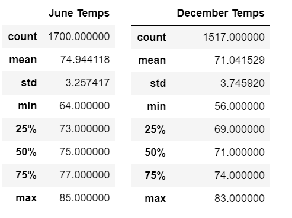

# surfs_up

## Overview

### The Request
   W. Avy has asked for temperature information for June and December in order to give a sense of year-round viability to our Surf and Shake stand.
   
### The Task
   This will require us to use the sqlalchemy extract function in order to filter our query by month.  Our results can go in a list, and then a dataframe.

## Results

### Summary Statistics

### # Highlights

1. The avergae temperatures from June (74.9) and December (71.0) are very close to each other, and are both decent climates for surf and/or shakes!

2. The minimum temperature recorded in December was 56 and in June it was 64.  So there could be a few more days in December compared to June that would be "off" days for business.

3. Neither months really "bring the heat", with maxes at 85 in June and 83 in December.  This means shakes might not be as in demand as surfing.

## Summary

### High-Level Review
  Overall, W. Avy should feel inspired to present the good news to the board of directors, who in turn should feel inspired to invest in the shop in Oahu, Hawaii without fear of weather being a negative factor in the business.  Neither precipition (from the module) nor temperature info show any significant dangers of this shop's business being seriously interrupted for long.  If it is well managed with a strong business plan, it should be profitable and sustainable.

### Additional Queries

1. We could take the temperature data we already have for June and December as they are in their dataframes and plot them across the years to see if there are any overall climate trends that could affect the stats in the next 5 to ten years out on our investment.  

2. We could also run a separate query and bar plot to show the precipitation and temperature data side by side throughout the year.  Or, similarly, we could group the monthly info that covers multiple years to help get a strong sense of what to expect during the year.
